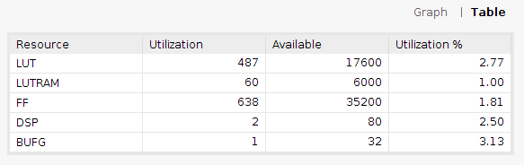

---
lang: es-AR
title: Multiplicador de punto flotante
subtitle: Trabajo práctico final MyS - CESE 10 Cohorte
author: Diego Essaya
...

# Introducción

El componente desarrollado (desarrollado para la materia CLP) permite
multiplicar dos números de punto flotante, según la norma IEEE-754, para una
cantidad genérica de bits de palabra (`N`) y exponente (`E`).

Para el desarrollo de este TP, se generó una IP a partir del componente,
mediante el IP Packager de Vivado. Luego se creó un proyecto en el que se
conectó la IP al sistema de procesamiento ZYNQ7 mediante el bus AXI4 Lite,
y un programa en C que efectúa la multiplicación de dos números de punto
flotante.

# Archivos

El componente está desarrollado en lenguaje VHDL y consta de los siguientes
archivos:

* Componentes:
    * `fpmul.vhd`: Multiplicador de punto flotante
    * `mul.vhd`: Multiplicador de enteros
    * `addern.vhd`: Sumador de n bits
    * `adder1.vhd`: Sumador de 1 bit
* Simulaciones:
    * `adder1_tb.vhd`
    * `addern_tb.vhd`
    * `mul_tb.vhd`
* Simulación y prueba del componente `fpmul`:
    * `fpmul_tb.vhd`
    * `delay.vhd`, `ffd.vhd`: Delay y flip-flop D, utilizados en `fpmul_tb.vhd`
    * `test-files`: Casos de prueba con diferentes valores de `N` y `E`
* Scripts para compilar con GHDL y visualizar la simulación con GTKWave
  (instrucciones en `README.md`):
    * `Makefile`
    * `Makefile.adder1`
    * `Makefile.addern`
    * `Makefile.mul`

El código C está en el archivo `fpmul_prj/fpmul_prj.sdk/fpmul/src/fpmul.c`.

# Funcionamiento

El componente `fpmul` tiene los siguientes parámetros genéricos:

```vhdl
generic (
    N: integer := 32;
    E: integer := 8
);
```

donde `N` es el tamaño de palabra y `E` la camtidad de bits del exponente.
La configuración por defecto (32 y 8 respectivamente) corresponde al tipo
`binary32` del estándar IEEE-754.

Los puertos son:

```vhdl
port (
    a, b: in std_logic_vector(N - 1 downto 0);
    p: out std_logic_vector(N - 1 downto 0)
);
```

siendo `a` y `b` los números de punto flotante a multiplicar y `p` el producto
calculado, en el mismo formato.

La palabra de `N` bits contiene 1 bit para representar el signo, `E` bits para
el exponente y el resto (`NP`) para la mantisa:

```vhdl
constant NP: integer := N - E - 1;
```

```
signo                   fracción/significando/mantisa (NP bits)
 |                      /                                     \
 | exponente (E bits)  /                                       \
 |   /           \    /                                         \
 0  1 0 0 0 0 0 0 0  1 0 0 1 0 0 1 0 0 0 0 1 1 1 1 1 1 0 1 1 0 1 1

N-1 N-2  ......  NP  NP-1                                        0
```

La arquitectura del componente `fpmul` efectúa a grandes rasgos los siguientes
pasos:

1. Multiplicar las mantisas de `a` y `b` (utilizando el componente `mul`).
1. Sumar los exponentes de `a` y `b` y luego restar el _bias_ (esto se hace con
   dos instancias de `addern`).
1. El producto de las fracciones puede haber dado un número con 1 o 2 dígitos
   enteros (en binario, `01.xxx` o `1x.xxx`). En el segundo caso hay que correr
   la coma decimal un lugar a la izquierda e incrementar el exponente en 1;
   este incremento se efectúa con una instancia más de `adder1`.
1. El proceso `normalize` revisa en cuál de los dos casos mencionados estamos y
   trunca la mantisa y exponente apropiadamente.
1. El procedimiento `check`:
   1. Calcula el signo resultante como el signo de `a` XOR el signo de `b`.
   1. verifica si estamos en un caso de overflow o underflow,
      en cuyo caso provoca que la salida refleje el estado correspondiente.


# Pruebas

El componente `fpmul_tb` permite ejecutar miles de casos de prueba especificados en
los archivos ubicados en `test-files`, y para cada caso verifica que la salida
del componente sea correcta.

Ejemplo de una corrida de los casos de prueba:

```
$ make test
ghdl -r fpmul_tb --vcd=fpmul.vcd --assert-level=error
fpmul_tb.vhd:120:9:@15ns:(report note): TEST: FF7FFFFF * 3F416F2B = FF416F2A
fpmul_tb.vhd:120:9:@35ns:(report note): TEST: FF7FE5C6 * BEE7652D = 7EE74D78
fpmul_tb.vhd:120:9:@55ns:(report note): TEST: FF7FCB8E * 400690D4 = FF7FFFFF
fpmul_tb.vhd:120:9:@75ns:(report note): TEST: FF7FB156 * 3FB176D1 = FF7FFFFF
fpmul_tb.vhd:120:9:@95ns:(report note): TEST: FF7F971E * BE929FC6 = 7E9263B3
fpmul_tb.vhd:120:9:@115ns:(report note): TEST: FF7F7CE5 * 3DCCC228 = FDCC594B
[...]
fpmul_tb.vhd:120:9:@399895ns:(report note): TEST: 3F0A6F33 * C14316A3 = C0D2FDE3
fpmul_tb.vhd:120:9:@399915ns:(report note): TEST: BF50BA33 * 41E68E60 = C1BBFB5F
fpmul_tb.vhd:120:9:@399935ns:(report note): TEST: 3F82205B * 40D15A17 = 40D4D46A
fpmul_tb.vhd:120:9:@399955ns:(report note): TEST: 400790C6 * 417C2993 = 42058886
fpmul_tb.vhd:120:9:@399975ns:(report note): TEST: C0640590 * C128600F = 4215F935
fpmul_tb.vhd:120:9:@399995ns:(report note): TEST: 3E9C3D08 * 41A1FE8C = 40C5BB78
fpmul_tb.vhd:93:16:@400010ns:(assertion failure): Fin de la simulacion
```

Notar que el mensaje `assertion failure` en este caso no indica que falló una
prueba sino que corresponde a la última instrucción del código de pruebas:

```vhdl
assert false report "Fin de la simulacion" severity failure;
```

# Simulaciones

Los componentes `adder1_tb.vhd`, `addern_tb.vhd`, `mul_tb.vhd`y `fpmul_tb.vhd`
permiten hacer simulaciones de cada uno de los componentes utilizados en el
diseño. A continuación se muestran capturas de pantalla de GTKWave mostrando el
resultado de dichas simulaciones:


# Síntesis e implementación

Se utilizó el software Vivado 2018.1 para realizar la síntesis e implementación
del sistema, sobre la placa Arty-Z7-10.





